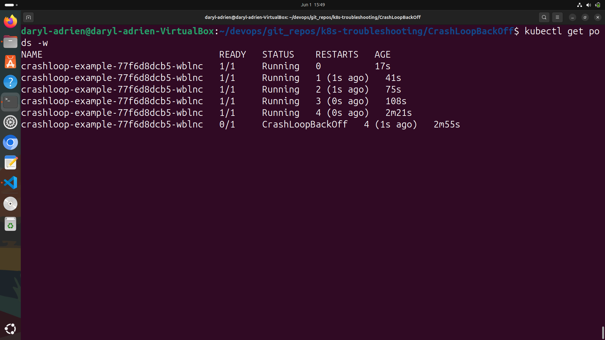
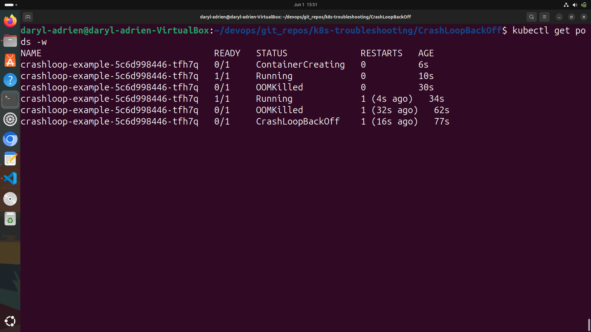
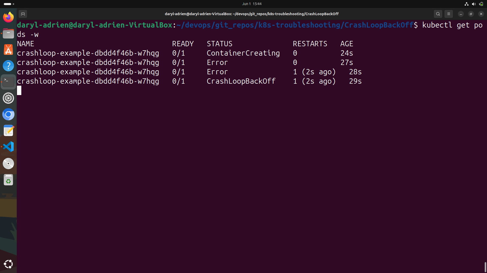

# CrashLoopBackOff

When you see "CrashLoopBackOff," it means that kubelet is trying to run the container, but it keeps failing and crashing. After crashing, Kubernetes tries to restart the container automatically, but if the container keeps failing repeatedly, you end up in a loop of crashes and restarts, thus the term "CrashLoopBackOff." 

This situation indicates that something is wrong with the application or the configuration that needs to be fixed.

## Common Situations of CrashLoopBackOff

The CrashLoopBackOff error in Kubernetes indicates that a container is repeatedly crashing and restarting. Here are explanations of how the CrashLoopBackOff error can occur due to the specific reasons you listed:

### Misconfigurations

Misconfigurations can encompass a wide range of issues, from incorrect environment variables to improper setup of service ports or volumes. These misconfigurations can prevent the application from starting correctly, leading to crashes. For example, if an application expects a certain environment variable to connect to a database and that variable is not set or is incorrect, the application might crash as it cannot establish a database connection.

### Errors in the Liveness Probes

Liveness probes in Kubernetes are used to check the health of a container. If a liveness probe is incorrectly configured, it might falsely report that the container is unhealthy, causing Kubernetes to kill and restart the container repeatedly. For example, if the liveness probe checks a URL or port that the application does not expose or checks too soon before the application is ready, the container will be repeatedly terminated and restarted.

### The Memory Limits Are Too Low

If the memory limits set for a container are too low, the application might exceed this limit, especially under load, leading to the container being killed by Kubernetes. This can happen repeatedly if the workload does not decrease, causing a cycle of crashing and restarting. Kubernetes uses these limits to ensure that containers do not consume all available resources on a node, which can affect other containers.

### Wrong Command Line Arguments

Containers might be configured to start with specific command-line arguments. If these arguments are wrong or lead to the application exiting (for example, passing an invalid option to a command), the container will exit immediately. Kubernetes will then attempt to restart it, leading to the CrashLoopBackOff status. An example would be passing a configuration file path that does not exist or is inaccessible.

### Bugs & Exceptions

Bugs in the application code, such as unhandled exceptions or segmentation faults, can cause the application to crash. For instance, if the application tries to access a null pointer or fails to catch and handle an exception correctly, it might terminate unexpectedly. Kubernetes, detecting the crash, will restart the container, but if the bug is triggered each time the application runs, this leads to a repetitive crash loop.