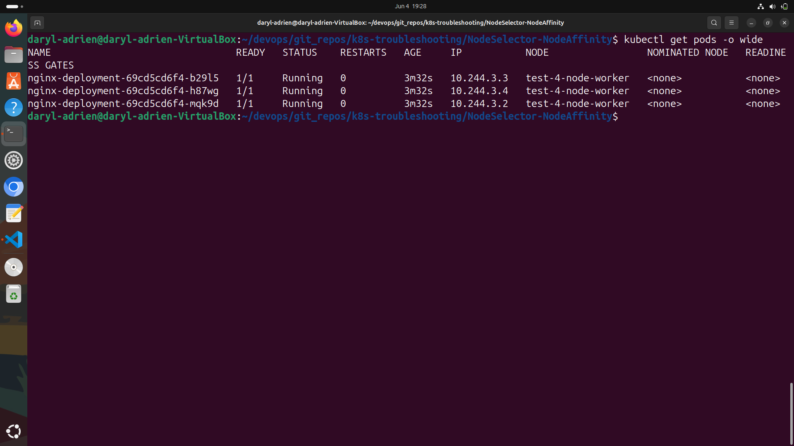

In Kubernetes, the scheduler is responsible for assigning pods to nodes in the cluster based on various criteria. Sometimes, you might encounter situations where pods are not being scheduled as expected. This can happen due to factors such as node constraints, pod requirements, or cluster configurations.





1. Node Selector

Node Selector is a simple way to constrain pods to nodes with specific labels. It allows you to specify a set of key-value pairs that must match the node's labels for a pod to be scheduled on that node.
Usage: Include a nodeSelector field in the pod's YAML definition to specify the required labels.

```
spec:
    containers:
    - name: my-app
    image: my-image
    nodeSelector:
    disktype: ssd
```

2. Node Affinity

Node Affinity is a more expressive way to specify rules about the placement of pods relative to nodes' labels. It allows you to specify rules that apply only if certain conditions are met.
Usage: Define nodeAffinity rules in the pod's YAML definition, specifying required and preferred node selectors.

```
spec:
    containers:
    - name: my-app
    image: my-image
    affinity:
    nodeAffinity:
        requiredDuringSchedulingIgnoredDuringExecution:
        nodeSelectorTerms:
        - matchExpressions:
            - key: disktype
            operator: In
            values:
            - ssd
```

3. Taints

Taints are applied to nodes to repel certain pods. They allow nodes to refuse pods unless the pods have a matching toleration.
Usage: Use kubectl taint command to apply taints to nodes. Include tolerations field in the pod's YAML definition to tolerate specific taints.

```
kubectl taint nodes node1 disktype=ssd:NoSchedule
```

```
spec:
    containers:
    - name: my-app
    image: my-image
    tolerations:
    - key: disktype
      operator: Equal
      value: ssd
      effect: NoSchedule
```

4. Tolerations

Tolerations are applied to pods and allow them to schedule onto nodes with matching taints. They override the effect of taints.

Usage: Include tolerations field in the pod's YAML definition to specify which taints the pod tolerates.

```
spec:
  containers:
  - name: my-app
    image: my-image
  tolerations:
  - key: disktype
    operator: Equal
    value: ssd
    effect: NoSchedule
```